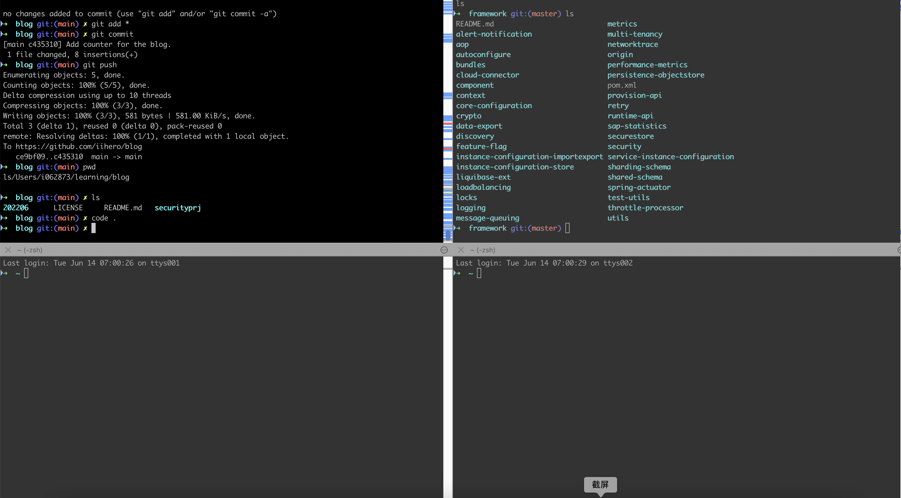

# 切换到MacOS工作环境

### 作者

iihero

### 日期

2022-06-19

### 标签

Mac OS  MacBook 

# 背景

用了多年的windows系列，终于也要切换到Mac OS用作工作环境了。毕竟大家都觉得用Mac系列比windows系列还是要效率高些。三年一换，这次大多数人都换成了macbook了。 

我拿到的配置是：Apple M1 MacBook Pro 14 10Pro/16 16GB RAM and 1TB  disk。看起来还是不错的。对于常规的东西应该是够用的。

# 环境对比

## 一、输入法

Windows:  极点五笔，多年未变  
MacBook： 自带的简体五笔    试用了几下，效果也还可以。就是中英文以及英文的大写切换，实在有些受不了，输入大写的时候，需要长按一些那个中/英键。

## 二、软件安装

一般的软件或公司指定的软件包，从Self Service里头进去，可以直接选择安装，包括MacOS的升级。但是碰到一些用于开发的的软件包，就只能自己去找了，有很多收费的，我基本上也不会去碰。

通常大家用的多的也就是通过Homebrew安装管理工具，简单的一条指令，就可以实现包管理，而不用你关心各种依赖和文件路径的情况，十分方便快捷。Homebrew 在 2009 年由马克斯·霍威尔（Max Howell）写成，它在 GitHub 上拥有大量贡献者，目前仍处于活跃状态。

在Homebrew弄完以后，想要安装JMeter, 直接用：brew install jmeter一下子就可以搞定。

## 三、文本编辑器

Windows：我一直混用各种文本编辑器，哪个方便用哪个。Notepad++,  scite,  gvim7,  甚至还用过正版的ultra edit(用于处理超大文本文件，后来为了省钱，还是把它给卸载了，也从公司的订单里头退掉了。)，VsCode （对，没说错，发现它用于处理特大文本文件，有时候还是蛮管用的), sublime text 也曾少量用过。

MacBook: 刚切进来的时候，确实有些不太适应，用vim/vi比较多一点。然后又装了一个MacVim, 用起来也还可以，中小型文件少量编辑，没什么大问题。再到后来，发现sublime text用起来也比较顺，各种插件弄进去，效率能高不少。

## 四、Term工具

既然用于工作，除了文本编辑，还有一个就是要登陆各种linux服务器或者远程桌面windows，少不了需要一些term工具。

Windows下，我常用的是putty + multitab.  实际上就是把putty集成到多个tab页上，使用起来很方便。又是完全免费的。基本上够用。远程桌面，一直用的是multidesk免费版。虽然分辨率低一点，但是对于日常工作，也完全够用。

Macbook下，iterm2是最爱，发现它居然能切割窗口，可以把它切成4个分屏。同时开4个工作窗口，如果投影到大屏幕，感觉立马很清新。如下图所示：

其实windows上针对dos命令行，也有它不错的windows terminal工具，速度非常快，也可以分tab页。不过，也有第三方的免费的cmder,  用起来也真心不错，一样的可以分成多个屏幕。

MacBook上的远程桌面工具，我目前用的是：Microsoft Remote Desktop， 说不上好与坏，凑合着用。

## 五、IDE 集合

Windows:  Visual Studio 2017 Enterprise,  VS Code,  STS (eclipse), Intellij

Macbook: VS Code, Xcode(只打开看code,  很少用来开发调试)，STS，Intellij， 安装的时候也有各种坑。总的来说，安装完以后，基本上就不用操心了。

至于涉及到的编程语言工具及环境：nodejs, python, perl, groovy, 等等，没什么区别，装完以后。略。

## 六、各类测试工具

两个平台没有太大区别。

Windows: Postman, SoapUI, JMeter .... Macbook上这几个也都有。只是速度好像不怎么样。凑合着用。

## 七、代码管理工具

Git command line, 通用。略。使用方法倒是有非常多。github, errit git.两种仓库我们都在用。

## 七、Cloud相关工具

cf cli,  aws client tools, azure client tools, redis tools，mongo db client tools 随时间推移，有的可能已经不用了。但都是这条线上。

## 八、数据库及相关工具

在我们看来，没啥区别，数据库大多都装到申请的vm上，本机也会装一个PostgreSQL之类的备用。源码安装或者安装包安装都可以，适用于不同的目的。用于访问数据库的工具：通用的，大多使用DBEaver (限于公司的使用策略，只能使用社区版)，但基本上够用。PG数据库我另外可以使用pgAdmin或者命令行。完全能胜任。

对于ASE数据库，有点小遗憾。在windows下，我经常使用以前自己整理打包的sybase central15.7 ESD#2这个版本。macbook上是没有这个版本了。只好登陆到服务上，或者干脆用DBEaver或命令行来弄一下。

HANA数据库，可以使用HanaStudio来管理和访问。DBEaver替补。

SQL Anywhere（ASA）数据库，sybase central 是有的。经常用它。DBEaver替补。

我还有一个自己编写的xsql做最重要的替补，很多功能是那些管理工具没有的。尤其是用于大规模数据迁移的时候。

 