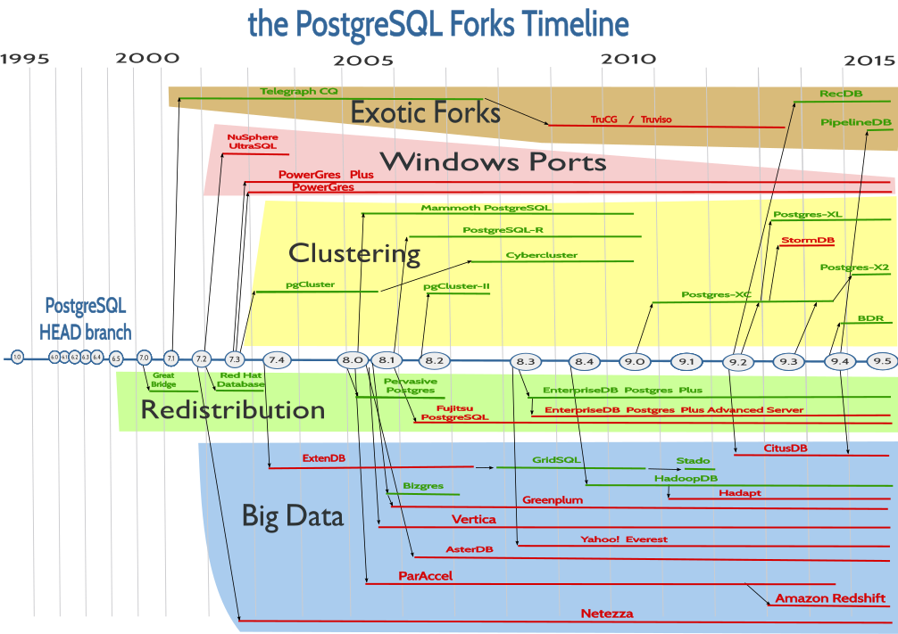

# PostgreSQL的历史时间线(截至9.5)

### 作者

iihero

### 日期

2022-07-03

### 标签

PostgreSQL, timeline

## 背景

 

在2011、2012年的时候，我就曾经预言（预计）十年以内，PostgreSQL即将会在全世界大放异彩。有一个主要原因是它的开放式的策略。它采用的是：  
PostgreSQL is released under the PostgreSQL License, a liberal Open Source license, similar to the BSD or MIT licenses.   
大家只要了解到BSD或者MIT license就知道，它是一个多么宽松的license。  对于开发和使用者来说，基础上没有任何限制。这也在一定程度上会让PostgreSQL数据库不会受任何一家公司或厂商独立控制。  随着云计算的高速发展， 未来10年，到2032年，PostgreSQL数据库及其衍生品极有可能占据云数据库的最大份额。 趋势不可阻挡。 

这里贴上一张图，让大家了解一下PostgreSQL截至2015年的历史时间线。

[202207/timeline_postgresql-till-9.5.png](timeline_postgresql-till-9.5.png)

### 参考资料
* https://wiki.postgresql.org/wiki/PostgreSQL_derived_databases   
* https://github.com/rafaelma/postgresql-timeline   

