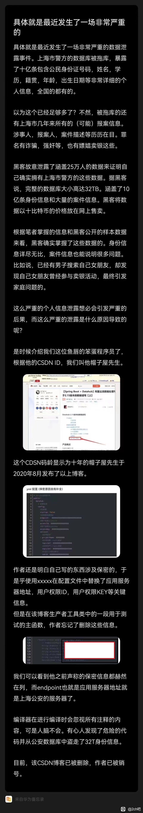

# 这次也许是历来最严重的数据安全事故

### 作者

iihero

### 日期

2022-07-04

### 标签

database, security, cybersecurity

## 背景

上海某云数据库，这次发生了极其严重的数据泄露事故，并被黑客进行勒索（10个比特币)。数据量之大（待求证）令人咋舌。  
后来经过一番求证，发现引发这次事故的居然是一员工的不经意的一段代码注释。  可见国内对于信息安全是多么的不重视。尤其是广大的程序员们，在写代码的时候，一定要注意符合基本的安全规范。  

这里帖上一幅图，代码注释泄露相关信息的部分已做mask处理。其实这是在写代码的时候最基本的要求，注释掉的代码，一定要直接删除，也不要留有任何credentials信息，无论是测试代码还是非测试代码。这也是最基本的要求啊。

 
