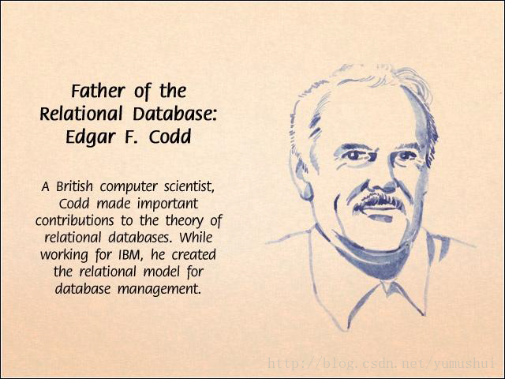

# 关系型数据库发展演义

### 作者

iihero

### 日期

2022-07-08

### 标签

RDBMS, database, 关系数据库, Oracle, DB2, Sybase, Informix, PostgreSQL, Ingres, SQLServer, SQL

## 背景

这是一篇旧文，摘自10年前在CSDN上的一些摘要。录于此，以纪念为关系数据库作出重大贡献的“大侠”及相关公司。

市场上目前流行多种关系型数据库，我们在学习技术的同时，也应该对她们的发展历史有所了解，这对我们日后把握新技术的方向能起到关键性的指引作用，或许你还能从本文中找到比技术更重要的东西。

在文章开始前，首先要介绍几位对关系型数据库发展起决定性作用的人，尽管我是一个历史唯物主义者，但无法改变我对这些前辈的景仰之情。

* --Edgar Frank Codd：关系数据库之父。1970年，Codd划时代的论文《用于大型共享数据库的关系数据模型》

  

  * Codd全关系系统十二准则

  * 准则0

  一个关系形的关系数据库系统必须能完全通过它的关系能力来管理数据库。

  * 准则1 信息准则

  关系数据库系统的所有信息都应该在逻辑一级上用表中的值这一种方法显式的表示。

  * 准则2 保证访问准则

  依靠表名、主码和列名的组合，保证能以逻辑方式访问关系数据库中的每个数据项。

  * 准则3 空值的系统化处理

  全关系的关系数据库系统支持空值的概念，并用系统化的方法处理空值。

  * 准则4 基于关系模型的动态的联机数据字典

  数据库的描述在逻辑级上和普通数据采用同样的表述方式。

  * 准则5 统一的数据子语言

  一个关系数据库系统可以具有几种语言和多种终端访问方式，但必须有一种语言，它的语句可以表示为严格语法规定的字符串，并能全面的支持各种规则。

  * 准则6 视图更新准则

  所有理论上可更新的视图也应该允许由系统更新。

  * 准则7 高级的插入、修改和删除操作

  系统应该对各种操作进行查询优化。

  * 准则8 数据的物理独立性

  无论数据库的数据在存储表示或存取方法上作任何变化，应用程序和终端活动都保持逻辑上的不变性。

  * 准则9 数据逻辑独立性

  当对基本关系进行理论上信息不受损害的任何改变时，应用程序和终端活动都保持逻辑上的不变性。

  * 准则10 数据完整的独立性

  关系数据库的完整性约束条件必须是用数据库语言定义并存储在数据字典中的。

  * 准则11 分布独立性

  关系数据库系统在引入分布数据或数据重新分布时保持逻辑不变。

  * 准则12 无破坏准则

  如果一个关系数据库系统具有一个低级语言，那么这个低级语言不能违背或绕过完整性准则。
  

* --Don Chamberlin：SQL之父。SQL 语言的创造者之一，也是 XQuery 语言的创造者之一。是IBM Fellow，ACM及IEEE 特别会员。他是SQL关系数据库语言的发明人之一，也是XQuery语言的设计基础Quilt语言的发明人之一。Don拥有加利福尼亚大学博士学位。他目前在IBM Almaden 研究中心工作，在过去几年中，他代表IBM参与W3C XML Query工作组的工作。

* 主流数据库的奠基人——Michael Stonebraker, 也是图灵奖获得者。SQL Server/Sysbase奠基人。著名的数据库科学家，他在1992 年提出对象关系数据库模型在加州伯克利分校计算机教授达25年。在此期间他创作了Ingres,Illustra, Cohera, StreamBase Systems和Vertica等系统。Stonebraker教授也曾担任过Informix的CEO，目前他是MIT麻省理工学院客席教授。

  

  Stonebraker 教授领导了称为Postgres的后Ingres项目。这个项目的成果非常巨大，在现代数据库的许多方面都做出的大量的贡献。Stonebraker 教授还做出了一件造福全人类的事情，那就是把Postgres 放在了BSD 版权的保护下。如今Postgres名字已经变成了PostgreSQL，功能也是日渐强大。

  87年左右，Sybase联合了微软，共同开发SQL Server。原始代码的来源与Ingres有些渊源。后来1994年，两家公司合作终止。此时，两家公司都拥有一套完全相同的SQLServer代码。可以认为，Stonebraker教授是目前主流数据库的奠基人。

* --Donald J. Haderle：DB2之父，IBM CTO、副总裁。

* --Larry Ellison：Oracle公司创始人，世界第二大软件公司的CEO。

* --Mark Hoffman：SYBASE公司创始人。--Bob Epstein：SYBASE公司创始人。

* --Mitchell E. Kertzman：PowerSoft公司创始人，后为SYBASE公司并购。

1970年IBM研究员Edgar Frank Codd发表了业界第一篇关于关系数据库理论的论文**《A Relational Model of Data for Large Shared Data Banks》**，首次提出了关系模型的概念。后来Codd又陆续发表多篇文章，奠定了关系数据库的基础。关系模型有严格的数学基础，抽象级别比较高，而且简单清晰，便于理解和使用。但是当时也有人认为关系模型是理想化的数据模型，用来实现DBMS是不现实的，尤其担心关系数据库的性能难以接受，更有人视其为当时正在进行中的网状数据库规范化工作的严重威胁。
为了促进对问题的理解，1974年ACM牵头组织了一次研讨会，会上开展了一场分别以Codd和Bachman为首的支持和反对关系数据库两派之间的辩论。这次著名的辩论推动了关系数据库的发展，使其最终成为现代数据库产品的主流。

1974年，IBM的Don Chamberlin和Ray Boyce将Codd关系数据库的12条准则的数学定义以简单的关键字语法表现出来，里程碑式地提出了SQL（Structured Query Language）语言。

SQL语言的功能包括查询、操纵、定义和控制，是一个综合的、通用的关系数据库语言，同时又是一种高度非过程化的语言，只要求用户指出做什么而不需要指出怎么做。SQL集成实现了数据库生命周期中的全部操作。自产生之日起，SQL语言便成了检验关系数据库的试金石，而SQL语言标准的每一次变更都指导着关系数据库产品的发展方向。

在SQL语言取得进展的同时，IBM研究中心于1973年开始着手SystemR项目。其目标是论证一个全功能关系DBMS的可行性。该项目结束于1979年，完成了第一个实现SQL的DBMS。1986年，ANSI把SQL作为关系数据库语言的美国标准，同年公布了标准SQL文本。目前SQL标准有3个版本。基本SQL定义是ANSIX3135-89，"Database Language - SQL with Integrity Enhancement"[ANS89]，一般叫做SQL-89。SQL-89定义了模式定义、数据操作和事务处理。SQL-89和随后的ANSIX3168-1989,"DatabaseLanguage-EmbeddedSQL"构成了第一代SQL标准。ANSIX3135-1992[ANS92]描述了一种增强功能的SQL，现在叫做SQL-92标准。SQL-92包括模式操作，动态创建和SQL语句动态执行、网络环境支持等增强特性。在完成SQL-92标准后，ANSI和ISO即开始合作开发SQL3标准。SQL3的主要特点在于抽象数据类型的支持，为新一代对象关系数据库提供了标准。

◆IBM DB2:SYSTEM R 完成后，Donald J. Haderle(DB2 之父)带领的小组在 1982 年到 1983 年之间完成了 DB2 for VSE/VM上的原型。

1983 年底，DB2 for MVS V1 正式发布，这标志着 DB2 产品化的开始，也标志着 DB2 品牌的创立。坦白地说，DB2 刚诞生的时候就像一个襁褓中的婴儿-发育不完全、娇嫩、经不起风吹雨打。为解决这个问题，Haderle于 1984 年领导成立了 DBTI（DB2 Technology Institution, DB2 技术研究所），这是一个集研究、开发、市场推广于一身，致力于发展 DB2 的部门。

DB2 的性能、可靠性、功能、吞吐量都有了极大的提高，已经能够适应各种关键业务的需求。

1988 年，DB2 for MVS 的卓越处理能力和稳定性得到了业界的广泛认可，DB2 终于从丑小鸭长成了天鹅。

1987: IBM 发布带有关系型数据库能力的 OS/2 V1.0扩展版，这是IBM第一次把关系型数据库处理能力扩展到微机系统。这也是 DB2 for OS/2、Unix and Window 的雏形。

1988: IBM 发布了SQL/400，为集成了关系型数据库管理系统的AS/400服务器提供了SQL支持。

1988: IDUG（国际DB2用户组织）组织成立。这标志着 DB2 的用户已经形成了相当的规模。

1989: IBM 定义了 Common SQL 和 IBM 分布式关系数据库架构（DRDA），并在 IBM 所有的关系数据库管理系统上加以实现。

1993: IBM 发布了DB2 for OS/2 V1（DB2 for OS/2 可以被简写为DB2/2）和DB2 for RS/6000 V1（DB2 for RS/6000 可以被简写为DB2/6000），这是 DB2 第一次在Intel 和Unix 平台上出现。

1994: IBM 发布了运行在 RS/6000 SP2 上的 DB2 并行版 V1，DB2 从此有了能够适应大型数据仓库和复杂查询任务的可扩展架构。

1994: IBM 将 DB2 Common Server 扩展到 HP-UX 和 Sun Solaris 上。DB2 开始支持其他公司开发的 UNIX 平台。

◆ORACLE:1977年6月Larry Ellison 他们三人合伙出资2000美元成立了软件开发RelationalSoftware公司，Ellison拥有60%的股份，即稍后的Oracle公司。

1976年IBM研究人员Codd博士发表了一篇里程碑的论文 "R系统:数据库关系理论",介绍了关系数据库理论和查询语言SQL, Ellison非常仔细地阅读了这篇文章，被其内容震惊，这是第一次有人用全面一致的方案管理数据信息。作者Codd几乎在近十年前就发表了关系数据库理论，并在IBM研究机构开发原型，这个项目就是R系统,存取数据表的语言就是SQL,文章详细描述了他十年的研究成果和如何实现的方法，Ellison 看完后，敏锐意识到在这个研究基础上可以开发商用软件系统。那时大多数人认为关系数据库不会有商业价值，因为速度太慢，不可能满足处理大规模数据或者大量用户存取数据，关系数据库理论上很漂亮而且易于使用，但不足就是太简单实现速度太慢。

Ellison认为这是他们的机会:他们决定开发通用商用数据库系统Oracle,这个名字来源于他们曾给中央情报局做过的项目名。不过也不是只有他们独家在行动，Berkeley大学也开始开发关系数据库系统Ingres.

他们次年完成了Oracle1，用汇编语言开发，基于RSX操作系统，运行在128KB内存的PDP-11小型机上。但这个产品没有正式发布。

1980年，Oracle公司正式发布了基于Vax/VMS系统的Oracle2。

两年后，他们发布了Oracle3，主要用C语言开发，具有事务处理的功能。

1983年，RelationalSoftware公司改名为Oracle公司。次年，他们推出Oracle4，扩充了数据一致性支持，并开始支持更广泛的平台 。Oracle的主要对手是Ingres,1984年Oracle的销售额是1270万美元，Ingres是900万美元,1985年两者销售额都翻了一倍以上，只是Ingres增长得更快，如果照此发展,Ingres将会超越对手,但这时蓝色巨人IBM又帮了Ellison一把.

1985年IBM发布了关系数据库DB2,采用了和Ingres不同的数据查询语言SQL, Ingres用的是QUEL, Ellison 抓住了市场机会,到处宣传Oracle和IBM的兼容性,结果从1985年到1990年虽然Ingres的销售额每年增长高于50%，但Oracle远远跑在了前面，每年增长率超过100%，SQL在1986年成为了正式工业标准,Ingres的老板简直无法相信Ellison的运气,但这正是Ellison的精明之处，"跟着蓝色巨人，永远不会错。"

IBM确立SQL的标准是Oracle成功的关键,但数据库的战争远未结束.
Sybase和Informix也加入了竞争的行列. IBM 却没有计划开发,为什么蓝色巨人放弃了这个价值上百亿的产品，原因有很多：IBM的研究人员大多是学术出身,他们最感兴趣的是理论，而不是推向市场的产品，从学术上看，研究成果应该公开，发表论文和演讲能使他们成名，为什么不呢？还有一个很主要的原因就是IBM当时有一个销售得还不错的层次数据库产品IMS,推出一个竞争性的产品会影响IMS的销售和人员工作，直到1985年IBM才发布了关系数据库DB2,Ellision那时已经成了千万富翁。

Ellison曾将IBM选择Microsoft的MS-DOS作为IBM-PC机 的操作系统比为："世界企业经营历史上最严重的错误，价值超过了上千亿美元。"，IBM发表R系统论文,而且没有很快推出关系数据库产品的错误可能仅仅次之,Oracle的市值在1996年就达到了280亿.。

1986年的Oracle5实现了真正的Client/Server结构，开始支持基于VAX平台的群集，成为第一个具有分布式特性的数据库产品。

1988年Oracle公司发布Oracle6。1992年正式推出Oracle7。

◆SYBASE:1984年Sybase由Mark Hoffman和Bob Epstein共同创立。
公司名称"Sybase"取自"system"和"database"相结合的含义。

Sybase公司的创始人之一Bob Epstein是Ingres大学版（与System/R同时期的关系数据库模型产品）的主要设计人员。

公司的第一个关系数据库产品是1987年5月推出的SybaseSQLServer1.0。Sybase首先提出了Client/Server数据库体系结构的思想，并率先在自己的SybaseSQLServer中实现。

1985年Sybase第一个会计年度营业额达150万美元。

1986年Sybase率先推出专为在线网络化应用程序而设计的关连式数据库，并与美国微软公司结为策略联盟。

同年，Sybase实现盈利。
1987年Sybase发表Sybase Open Client/Open Server应用程序接口，对不同的客户端 设备及Sybase Grows和Expands等数据来源，提供一般性的通讯功能。

1990年Sybase推介第一个将IBM MVS大型主机整合到局域网络主从环境的产品。美国财富(Fortune)杂志将Sybase列入美国成长最快速企业的前十名之内。

1991年Sybase营业收入超过一亿美元大关，1990会计年度营收数字为1亿400万美元，再度被财富杂志列为成长最快速的企业之一。
同年，Powersoft公司推出PowerBuilder 1.0。  
1992年Sybase公告1991会计年度的营收为1亿6000万美元，比1990会计年度成长65％。  
同年，Sybase发表System 10，率先提供全企业主从架构运算完整的作业架构。
1993年Sybase推出OmniSQL Gateway，使系统在不同组件的数据库之间，能够透通、跨平台作业。

同年，Sybase发表Replication Server，这是第一套针对分布式主从架构运算而设计 ，企业级、高取用性的解决方案。

1994年Sybase购并Micro Decisionware公司，并迅即发表 Enterprise CONNECT。

Enterprise CONNECT是第一个可跨平台作业的架构，提供关连式或非关连式、大型主机及主从架构环境前所未有的功能。

同年，Powersoft 并购Watcom并推出Infomaker。
1995年08月Sybase与Powersoft公司合并。在这里不得不提的是Powersoft公司创始人：Mitchell E. Kertzman。他有着和Microsoft的gates、Oracle的Ellison相似的经历，大学辍学、白手起家，经营某项专利技术直到把它作大，其公司的旗舰级产品Power Builder，曾经引领了一个时代。

同年，Sybase被时代华纳通讯公司选为标准系统，北京商品交易(Beijing Commodities Exchange)也选定Sybase为标准系统。

与此同时，Sybase成为第一家通过ISO 9001最高标准的软件公司。
而且，Sybase获选为美国航空暨太空总署(NASA)「Database of the Century」的核心技术。
Sybase成为全世界第六大软件公司。

2010年5月13日，Sybase被ERP巨头SAP公司以58亿美元收购。

◆INFORMIX:Informix在1980年成立，目的是为Unix等开放操作系统提供专业的关系型数据库产品。
公司的名称Informix便是取自Information和Unix的结合。
Informix第一个真正支持SQL语言的关系数据库产品是InformixSE（StandardEngine）。

InformixSE的特点是简单、轻便、适应性强。它的装机量非常之大，尤其是在当时的微机Unix环境下，成为主要的数据库产品。
它也是第一个被移植到Linux上的商业数据库产品。

在90年代初，联机事务处理成为关系数据库越来越主要的应用，同时，Client/Server结构日渐兴起。为了满足基于Client/Server环境下联机事务处理的需要，Informix在其数据库产品中引入了Client/Server的概念，将应用对数据库的请求与数据库对请求的处理分割开来，推出了Informix-OnLine，OnLine的一个特点是数据的管理的重大改变，即数据表不再是单个的文件，而是数据库空间和逻辑设备。逻辑设备不仅可以建立在文件系统之上，还可以是硬盘的分区和裸设备。由此提高了数据的安全性。

1993年，为了克服多进程系统性能的局限性，Informix使用多线程机制重新改写数据库核心，次年初，Informix推出了采用被称为"动态可伸缩结构"（DSA）的InformixDynamicServer。除了应用线程机制以外，Informix在数据库核心中引入了虚处理器的概念，每个虚处理器就是一个Informix数据库服务器进程。在DynamicServer中，多条线程可以在虚处理器缓冲池中并行执行，而每个虚处理机又被实际的多处理机调度执行。更重要的是：为了执行高效性和多功能的调谐，Informix将虚处理器根据不同的处理任务进行了分类。每一类被优化以完成一种特定的功能。到90年代后期，随着Internet的兴起，电子文档、图片、视频、空间信息、Internet/Web等应用潮水般涌入IT行业，而关系数据库所管理的数据类型仍停留在数字、字符串、日期等六七十年代的水平上，其处理能力便显得力不从心了。

1992年，著名的数据库学者、Ingres的创始人加州大学伯克利分校的MichaelStonebraker教授提出对象关系数据库模型，从而找到了一条解决问题的有效途径。

1995年，Stonebraker及其研发组织的加入了Informix，使之在数据库发展方向上有了一个新的突破：1996年Informix推出了通用数据选件（Universal Data Option）。这是一个对象关系模型的数据库服务器；它与其他厂商中间件的解决方案不同，从关系数据库服务器内部的各个环节对数据库进行面向对象的扩充；将关系数据库的各种机制抽象化、通用化。UniversalDataOption采用了DynamicServer的所有底层技术，如DSA结构和并行处理，同时允许用户在数据库中建立复杂的数据类型及用户自定义的数据类型，同时可对这些数据类型定义各种操作和运算以实现对象的封装。在定义操作和运算时可以采用数据库过程语言、C语言，它们经注册后成为服务器的一部分。1999年，Informix进一步将Universal Data Option进行了优化，为用户自定义数据类型和操作过程提供了完整的工具环境。同时在传统事务处理的性能超过了以往的Dynamic Server。新的数据库核心便被命名为IDS.2000。它的目标定位于下世纪基于Internet的复杂数据库应用。
2001年，被IBM收购。

◆MS SQL SERVER:1987年，微软和IBM合作开发完成OS/2，IBM在其销售的OS/2ExtendedEdition系统中绑定了OS/2DatabaseManager，而微软的产品线中尚缺少数据库产品，处于不利的位置。为此，微软将目光投向当时虽没有正式推出产品但已在技术上崭露头角的Sybase，同Sybase签订了合作协议，使用Sybase的技术开发基于OS/2平台的关系型数据库。1989年，微软发布了SQLServer1.0版。

1991年，微软和IBM宣布终止OS/2的合作开发，不过微软仍于1992年同Sybase合作推出了基于OS/2的SQLServer4.2版。这时，微软已经在规划基于WindowsNT系统的32位版本了。1993年，在推出WindowsNT3.1后不久，微软如期发布了SQL Server的Windows NT版，并取得了成功。

这时，微软和Sybase的合作出现了危机。一方面，基于Windows NT的SQL Server已经开始对Sybase基于Unix的主流产品形成竞争；另一方面，微软希望对SQL Server针对Windows NT做优化，却由于兼容性的问题，无法得到Sybase修改代码的认可。经协商，双方于1994年达成协议，宣布双方将各自发展数据库产品，微软得到了自由修改SQL Server代码的许可，此后，Windows NT成了SQL Server运行的惟一平台。继1995年发布代号为SQL95的SQLServer6.0后，微软推出了影响深远的SQL Server6.5。

SQL Server6.5是一个性能稳定、功能强大的现代数据库产品。值得一提的是该产品完全是使用Windows平台的API接口完成的，没有使用未公开的内部函数，完全作为一个应用程序工作，不直接使用操作系统的地址空间。SQLServer6.5采用多线程模型，支持动态备份，内嵌大量可调用的调试对象，提供开放式接口和一整套开发、管理、监测工具集合，还提供了多CPU的支持。

◆Interbase:由HP公司开发的一个较早并比较成熟的RDBMS，后转卖给Ashton-Tate公司，最后被Borland公司并购，目前主要集成在Borland公司的产品中。

看到这里，我们忽然发现这么多的关系型数据库产品内在有着千丝万缕的联系，每个公司都有着创建、发展、后退、再发展等几近相同的历史，包括IBM这样的蓝色巨人在90年代初期也曾一度徘徊，甚至有破产的危险。

我现在开始相信市场第一、技术第二这样的论断了......数据库的发展何去何从，关系型数据库的生命力还有多久？数据库现在的发展方向，是新近出现的将原有的关系数据库与许多其它的功能，如电子邮件、个人通讯等等相结合的趋势。而在企业自动化、电子政务等应用领域，人们相互进行的协同工作，也在与数据库技术融合。

比较热门的研究领域还有XML数据库技术，它主要处理关系数据库过去处理不了的半结构化数据，如文档数据，这跟传统的关系数据库是不一样的。数据库所管理的数据发生了根本的变化，它的基本标志就是从过去仅仅管理由键盘输入的数字、字符等简单数据，到今天必须管理由各种设备、装置、计算所产生的多种类型的复杂数据。例如，图形、图像、视频、音频、电子图书与档案、Web网页等等。这一变化给数据库技术带来了很多的挑战，需要我们研究许多新的问题。关系数据库已经无法胜任这种变化了的应用需求，可以说它使数据库技术的发展面临一个新的分水岭，我们必须寻求新的解决办法。

首先，数据库的一个基本问题就是要找到一个恰当的数据模型来表达它所管理的对象。关系数据库的模型可以简化为普通的表格，它对于表达键盘输入的数据十分到位。但是，如果我们用表格表达一本书，而书里面有文字、图形、图像、数学公式，还有很多特定领域特殊的内容，还要分成章节，这对关系数据库模型而言显然是件十分困难的事情，它处理不了这么复杂的数据内容与它们之间的结构。

第二，数据模型的变化意味着查询语言的变化。

第三，数据的变化，意味着后端对查询数据的处理要发生变化。过去的对象很简单，都是一行一行的纪录。现在一个对象除了一部电影、一幅图像、一个电视节目这些对象本身以外，还有很多关于它们的描述性的东西，即对象的元数据(对这些内容特征的描述)。比如一张照片，它的颜色、纹理等等，这使得数据本身呈现一种多维的趋势，数据库系统必须考虑这样的要求。第四，在存储方面，过去数据存储不太考虑10年、20年这样长期的存储。一般的数据用了一年两年之后，我们就采取备份的手段，把它倒到磁带上，变成离线的，再放到架子上，编目进行管理。现在则不同，一本书，一部档案，可能10年、20年以后还要用，用户只要有需要，都希望能把它在线地调出来使用。从存储容量的要求来看，现在的要求跟过去键盘输入时代的要求有天壤之别。如何在计算机里长期保存这样超大规模的数据，并且实现随时可用的在线访问，这就需要一个合理的存储系统，这显然不是仅仅增加磁盘阵列就能解决的问题。第五，是对数据的使用。传统的关系数据库保存的都是键盘输入的数据，对它的使用也很简单，就是查一条或者一组记录，然后在终端显示出来。今天，当我们把一张照片调出来，看照片要用特定的浏览器。我们把一本书调出来，需要各种索引服务。存储的对象和服务都产生了很大的变化，它会反过头来对数据库的支撑技术提出了很多的新要求。比如视频音频的索引技术，都会与现在关系数据库所处理的常规数据索引有很大的不同。不是我不明白，这世界变化快！

发展至今日，传统的关系数据库已经纷纷往云上发展。开源的PostgreSQL, MySQL各自发展出很多发行版，对其它商业数据库的威胁日渐严重。使用方式的改变让最终用户多了很多选择，一切都是为了降低使用成本。

 
